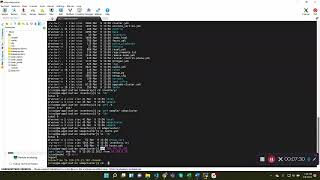

# SDAP-K8Cluster

# Setting up the SDAP Kubernetes Cluster 

To begin you must be in a base station.

1.	Clone the Kubespray from github, clone the version 2.15. The command is: 

```
git clone --depth=1 –branch release hhtp://github.com/Kubernetes-sigs/kubespray.git
```

2.	Then navigate into the cloned folder kubespray 

```
cd kubespray
```

3.	Inside that folder you have requirements.txt file. It has list of required packages. To install the packages, run the requirements.txt using  pip3:

```
sudo pip3  install -r requirement.txt
```

Note: If you don’t have pip3, install using below command:
 
```
sudo yum install python3-pip
```

4.	Go inside the inventory folder. It has two sub-folders local and sample

```
cd inventory
```
5.	Make a copy of the sample folder using the following command 
```
cp -prf sample/ sdapcluster
```

The new folder name is sdapcluster 

Ensure the process worked by using `ls -ltr` the new folder should appear, then go into the new folder 
```
cd sdapcluster/
```

6.	Create a hosts.yml using the command 

```
vi hosts.yml
```
Copy and paste the following content in the hosts.yml file. Here node 1 represents  master and node 2 and 3 represent working nodes. Make sure to change the <ip address> according to your server IP address. 

```
all:
  hosts:
    node1:
      ansible_host: <ip address>
      ip: <ip address>
      access_ip: <ip address>
    node2:
      ansible_host: <ip address>
      ip: <ip address>
      access_ip: <ip address>
    node3:
      ansible_host: <ip address>
      ip: <ip address>
      access_ip: <ip address>
  children:
    kube-master:
      hosts:
        node1:
    kube-node:
      hosts:
        node2:
        node3:
    etcd:
      hosts:
        node1:
    k8s-cluster:
      children:
        kube-master:
        kube-node:
    calico-rr:
      hosts: {}
```

7.	Now check you can connect base station to the kubernetes cluster master node using
```
 <ssh `your specified ip address`>
```
	Note: If there are any authentication issues copy the base station ssh key and paste it in the master node’s authorized keys file.
	 

8.	Look into add-ons file it is inside inventory/sdapcluster/group_vars/k8s-cluster/
```
cd group_vars/k8s-cluster/
```
9.	Look for addons.yml. Open the file using:
```
vi addons.yml
```
Make sure two variables helm_enable and ingress_nginx_enable set as true and then save file.

10.	Run the accessible playbook to run the kubernetes cluster. Make sure you are inside kubespray folder to run the below command:
```
ansible-playbook -i inventory/sdapcluster/host.yml cluster.yml –become –become-user=root
```

11.	Once process finish ssh into kubernetes master node, and check status of the nodes 
Login as a root user 
```
sude su -l
```
Use the below comment to check the status:
```
kubectl get nodes
``` 

# Tutorial video 

[](https://youtu.be/lzhOvDWBJoM)


